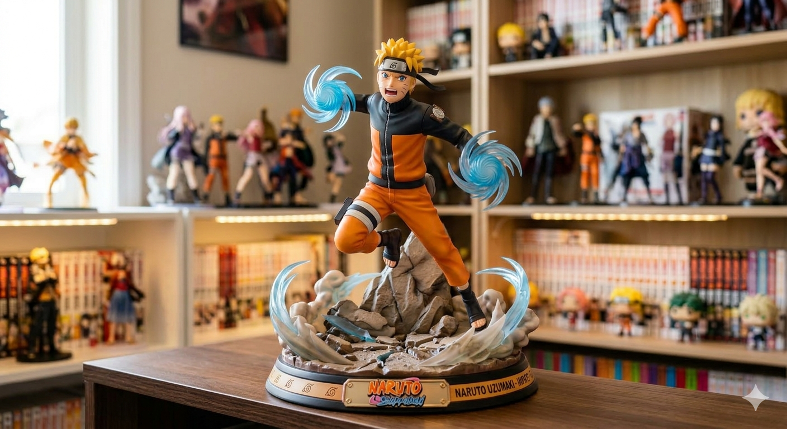
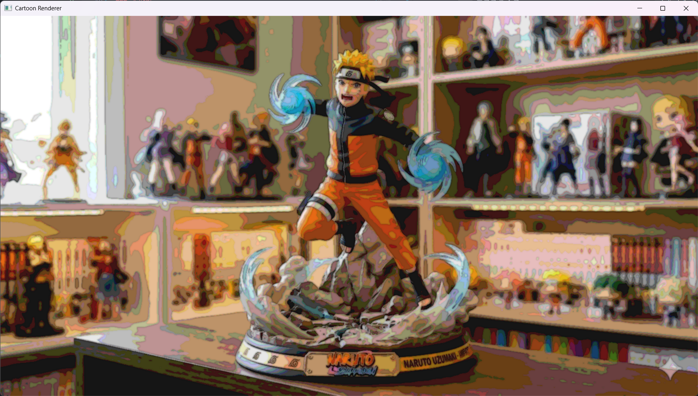
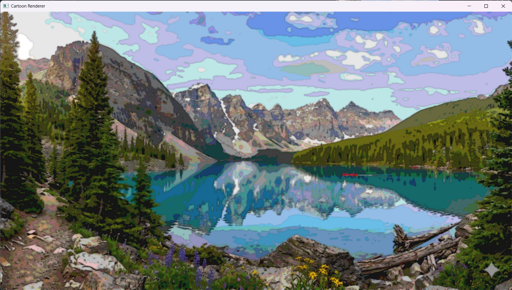

# seoultech-computervision-cartoon-rendering

(컴퓨터비전 과제 #3) OpenCV를 이용하여 주어진 이미지를 카툰 렌더링하는 프로그램

## 개요

이미지 파일을 선택해 카툰 렌더링 결과를 확인하고, 원본과 필터 결과를 전환하며 비교할 수 있습니다.

### 디렉토리

- `images` 폴더: 카툰 렌더링에 사용할 입력 이미지 저장
  - 예시용으로 생성형 AI Google Gemini로 만든 샘플 이미지 포함

### 실행 파일

- `app.py`

### 조작키

- `ESC`: 프로그램 종료
- `SPACE`: 필터 전환
- `ESC`: 새로운 원본 이미지 선택

## 데모 및 한계점 논의

### 1) 만화 느낌이 잘 표현되는 이미지 데모

- 입력 이미지
    
- 결과 이미지 (`get_cartoon_rendered_image_1()` 사용)
    

### 2) 만화 느낌이 잘 표현되지 않는 이미지 데모

- 입력 이미지
    
- 결과 이미지 (`get_cartoon_rendered_image_1()` 사용)
    

### 3) 알고리즘 한계점

`get_cartoon_rendered_image_1()`

- `Bilateral Filter`: 경계 보존 특성 때문에 배경 텍스처가 많은 이미지에서는 잔디, 나뭇잎 같은 미세 디테일이 남아 색면이 깔끔하게 정리되지 않을 수 있음
- `Laplacian`: 물체 경계뿐 아니라 작은 명암 변화와 잡음도 함께 강조되어 하늘, 물결, 그림자 주변이 거칠게 보일 수 있음
